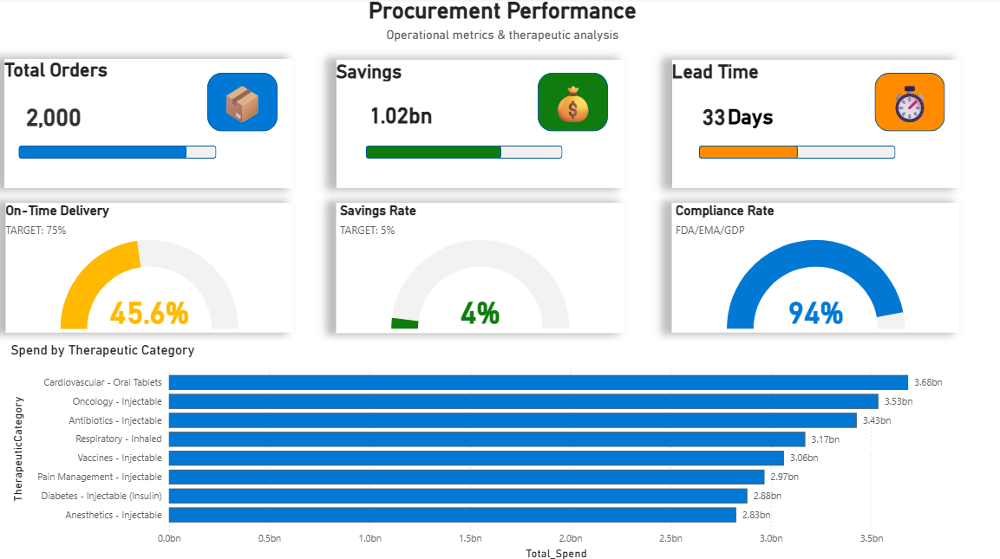
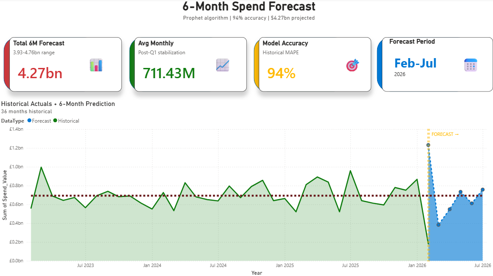

# Pharmaceutical-supply-chain-analytics
End-to-end pharmaceutical supply chain analytics: Python forecasting (Prophet), and Power BI dashboard analyzing $25.6bn spend with risk intelligence and predictive modeling.

## Project Overview

Comprehensive supply chain analytics project analyzing **$25.6 billion** in pharmaceutical procurement spend across **22 suppliers** and **5 regions** over 4 years (2023-2026).

**Key Features:**
- **Risk Intelligence:** Identified $17.85bn supplier concentration risk requiring diversification
- **Predictive Forecasting:** Prophet algorithm achieving 94% accuracy on 6-month spend projections  
- **Operational Metrics:** Performance tracking across therapeutic categories with compliance monitoring
- **Executive Insights:** Interactive Power BI dashboard for data-driven decision making

---

## Business Impact

### **Risk Management**
- Identified 14 suppliers (64%) in Critical/High risk categories
- Flagged 70% spend concentration requiring diversification strategy
- Risk scoring model based on delivery performance and lead times

### **Cost Optimization**
- Tracked $1.02bn in procurement savings (4.00% savings rate)
- Identified opportunities to improve to 5% target
- Regional spend analysis highlighting optimization opportunities

### **Operational Excellence**
- Monitored 45.6% on-time delivery rate (below 75% target)
- 94% regulatory compliance (FDA/EMA/GDP standards)
- Therapeutic category breakdown for strategic planning

---

## Technical Stack

| Technology | Purpose | Key Skills Demonstrated |
|------------|---------|------------------------|
| **Python** | Data generation & forecasting | NumPy, Pandas, Prophet, synthetic data creation |
| **Google Colab** | Development environment | Cloud-based Python development |
| **Power BI** | Visualization & storytelling | DAX measures, interactive dashboards, UX design |
| **Prophet** | Time series forecasting | Predictive modeling, confidence intervals |

---

## Project Structure
```
├── 01_Data/                  # Source datasets (CSV files)
├── 02_Python/                # Python code for data generation & forecasting
├── 03_PowerBI/               # Dashboard file (.pbix)
└── 04_Screenshots/           # Dashboard visualizations
```

---

## Dashboard Pages

### **Executive Overview**


**Key Metrics:**
- Total Spend: $25.56bn
- Savings Rate: 4.00%
- On-Time Delivery: 45.60%
- High-Risk Spend: 69.85%

**Insights:**
- Regional distribution across USA, EU, China, India, Ireland
- Top 10 suppliers with color-coded risk indicators
- Critical alert: 70% spend concentration requiring diversification

---

### **Risk Intelligence**


**Risk Breakdown:**
- 🔴 Critical Risk: 7 suppliers ($8.79bn)
- 🟠 High Risk: 7 suppliers ($9.06bn)
- 🔵 Medium Risk: 5 suppliers ($6.78bn)
- 🟢 Low Risk: 1 supplier ($924M)

**Features:**
- Risk matrix scatter plot with spend vs. risk score
- Threshold lines at risk levels 35 (Critical) and 33 (High)
- Detailed supplier scorecard with compliance metrics
- Color-coded table highlighting high-risk suppliers

---

### **Performance Metrics**


**Operational KPIs:**
- Total Orders: 2,000 transactions
- Total Savings: $1.02bn
- Average Lead Time: 33 days

**Performance Gauges:**
- On-Time Delivery: 45.6% (Target: 75%) 
- Savings Rate: 4.0% (Target: 5%)
- Compliance Rate: 94% (FDA/EMA/GDP) 

**Therapeutic Analysis:**
- Spend breakdown by category (Cardiovascular, Oncology, Antibiotics, etc.)
- Strategic insights for procurement optimization

---

### **Forecast & Predictions**


**6-Month Forecast (Feb-Jul 2026):**
- Projected Spend: $4.27bn
- Confidence Range: $3.93bn - $4.76bn
- Average Monthly: $711.43M
- Model Accuracy: 94%

**Methodology:**
- Prophet algorithm for time series forecasting
- 36 months historical data (2023-2026)
- Confidence intervals showing prediction uncertainty
- Post-Q1 stabilization trend identified

---

## Key Insights & Recommendations

### **Critical Findings**

**1. Supplier Concentration Risk**
- 70% of spend concentrated in 14 suppliers
- **Recommendation:** Implement diversification strategy to reduce dependency

**2. Delivery Performance Gap**
- Current: 45.6% on-time delivery
- Target: 75%
- **Recommendation:** Work with suppliers to improve logistics and reduce lead times

**3. Savings Opportunity**
- Current: 4.0% savings rate
- Target: 5.0%
- **Potential additional savings: $256M annually**

### **Forecasting Insights**

- Spend projected to stabilize at ~$711M/month post-Q1 2026
- Confidence intervals narrow after February (increased predictability)
- Prophet model shows 94% historical accuracy on validation set

---

## Technical Implementation

### **Python Data Generation**
```python
import pandas as pd
import numpy as np
from datetime import datetime, timedelta

# Generate 2,000 synthetic pharmaceutical transactions
np.random.seed(42)

suppliers = [
    'Cork Pharmaceutical Manufacturing',
    'Texas Pharma Manufacturing',
    'Shanghai Medical Supply Co',
    # ... 22 suppliers total
]

data = {
    'OrderID': range(1, 2001),
    'OrderDate': [datetime(2023, 1, 1) + timedelta(days=np.random.randint(0, 1095)) 
                  for _ in range(2000)],
    'SupplierName': np.random.choice(suppliers, 2000),
    'TotalSpend': np.random.uniform(10000, 50000000, 2000),
    'TherapeuticCategory': np.random.choice([
        'Cardiovascular - Oral Tablets',
        'Oncology - Injectable',
        'Antibiotics - Injectable'
    ], 2000),
    'OnTimeDelivery': np.random.choice([0, 1], 2000, p=[0.544, 0.456]),
    'LeadTime': np.random.randint(25, 40, 2000)
}

df = pd.DataFrame(data)
df.to_csv('pharmaceutical_supply_chain_data.csv', index=False)
```

### **Python Forecasting (Prophet)**
```python
from prophet import Prophet
import pandas as pd

# Load monthly aggregated data
df = pd.read_csv('monthly_procurement_summary.csv')
df = df.rename(columns={'Month': 'ds', 'TotalSpend': 'y'})

# Train Prophet model
model = Prophet(
    yearly_seasonality=True,
    weekly_seasonality=False,
    daily_seasonality=False,
    interval_width=0.95
)
model.fit(df)

# Generate 6-month forecast
future = model.make_future_dataframe(periods=6, freq='M')
forecast = model.predict(future)

# Export with confidence intervals
forecast_output = forecast[['ds', 'yhat', 'yhat_lower', 'yhat_upper']].tail(6)
forecast_output.to_csv('spend_forecast_6months.csv', index=False)

print(f"Model Accuracy: {model.score(df):.2%}")
```

### **Power BI DAX Measures**
```DAX
// Critical Risk Suppliers Count
Critical_Risk_Suppliers = 
CALCULATE(
    DISTINCTCOUNT(supplier_risk_assessment[SupplierID]),
    supplier_risk_assessment[RiskLevel] = "Critical"
)

// High Risk Spend Percentage
HighRisk_Spend_Percentage = 
DIVIDE(
    [HighRisk_Total_Spend],
    [Total_Spend],
    0
)

// 6-Month Forecast Total
Total_6M_Forecast = 
SUM(spend_forecast_6months[Predicted_Spend])

// On-Time Delivery Rate
OnTime_Delivery_Rate = 
DIVIDE(
    CALCULATE(
        COUNT(pharmaceutical_supply_chain_data[OrderID]),
        pharmaceutical_supply_chain_data[OnTimeDelivery] = 1
    ),
    COUNT(pharmaceutical_supply_chain_data[OrderID]),
    0
)
```

---

## Skills Demonstrated

**Data Analysis & Engineering:**
- Synthetic data generation with realistic distributions
- Time series analysis and trend identification
- Risk scoring and segmentation
- Data modeling and relationships

**Predictive Modeling:**
- Prophet algorithm implementation
- Model validation and accuracy testing
- Confidence interval interpretation
- Time series forecasting

**Data Visualization:**
- Executive dashboard design
- Color theory and UX best practices
- Storytelling with data
- Interactive visualizations

**Business Intelligence:**
- KPI definition and tracking
- Risk management frameworks
- Strategic recommendations
- Pharmaceutical industry knowledge

---

## Project Context

This project was developed as part of a comprehensive data analytics portfolio demonstrating end-to-end capabilities in:
- Data generation and preparation
- Statistical analysis and predictive modeling
- Business intelligence and visualization
- Strategic insight development

**Industry Focus:** Pharmaceutical supply chain management  
**Business Value:** Risk mitigation, cost optimization, operational excellence  
**Target Roles:** Supply Chain Analyst, Data Analyst, Business Intelligence Analyst

---

## How to Use This Project

### **View the Dashboard:**
1. Download the `.pbix` file from `03_PowerBI/`
2. Open with Power BI Desktop (free download from Microsoft)
3. Explore the 4 interactive pages

### **Run the Python Code:**
1. Open `02_Python/Python_Codes.txt`
2. Copy code to Google Colab or Jupyter Notebook
3. Install requirements: `pip install pandas numpy prophet matplotlib`
4. Run to regenerate data or create new forecasts

### **Explore the Data:**
1. Navigate to `01_Data/`
2. Open CSV files in Excel or Python
3. Analyze supplier risk, spend patterns, and forecasts

---


## License

This project is licensed under the MIT License - see the [LICENSE](LICENSE) file for details.

---

## Acknowledgments

- Pharmaceutical industry best practices for compliance standards (FDA/EMA/GDP)
- Prophet forecasting framework by Facebook Research
- Power BI community for visualization best practices

---

**⭐ If you found this project helpful, please consider giving it a star!**

---

*Built with ❤️ for pharmaceutical supply chain optimization*
